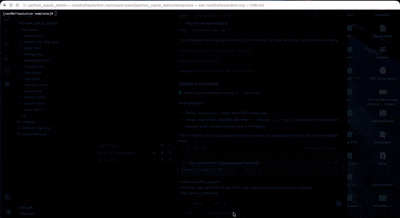
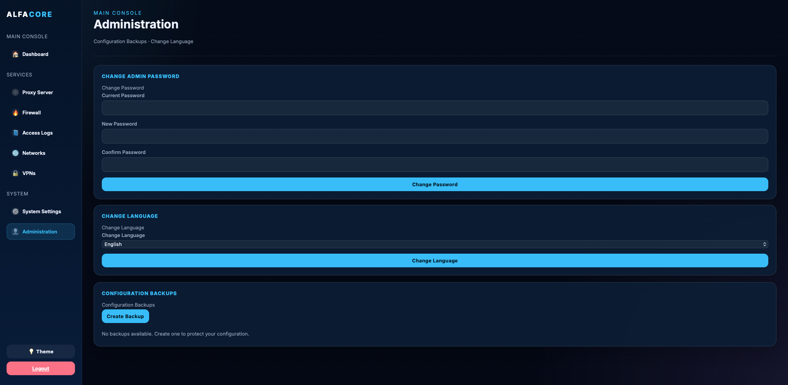
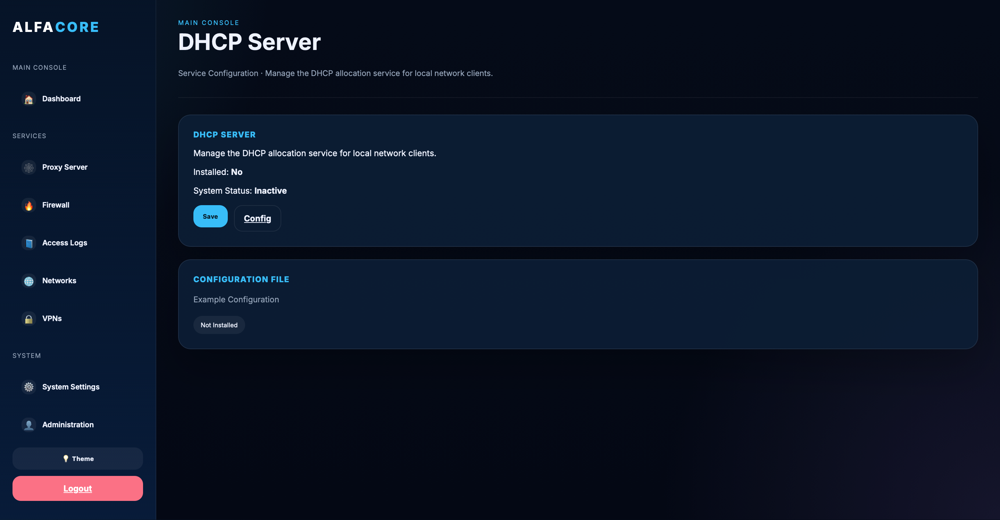
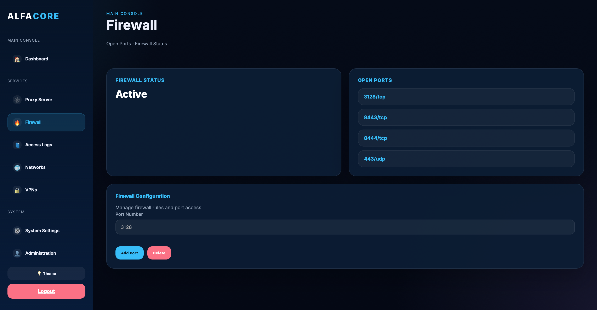
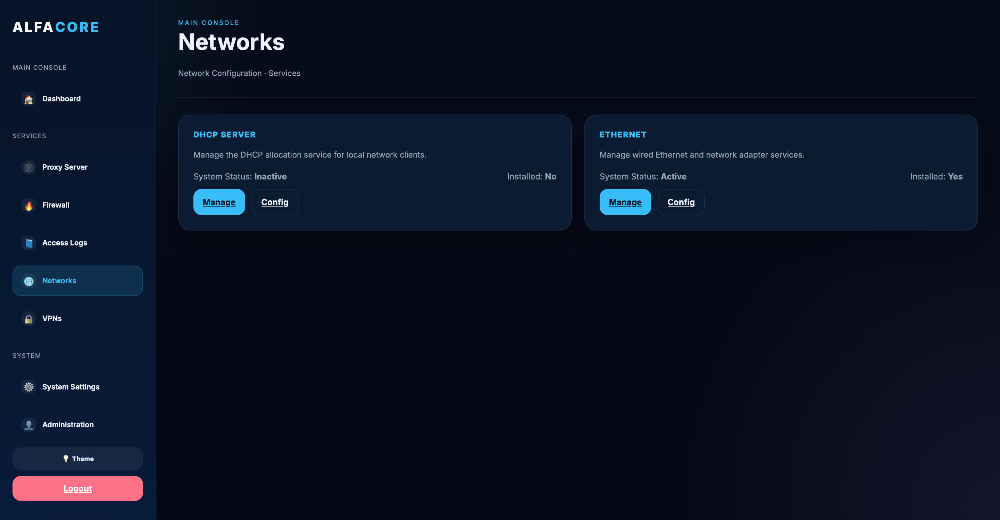
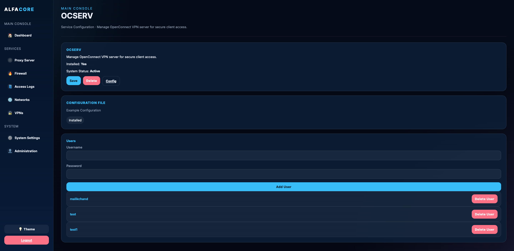
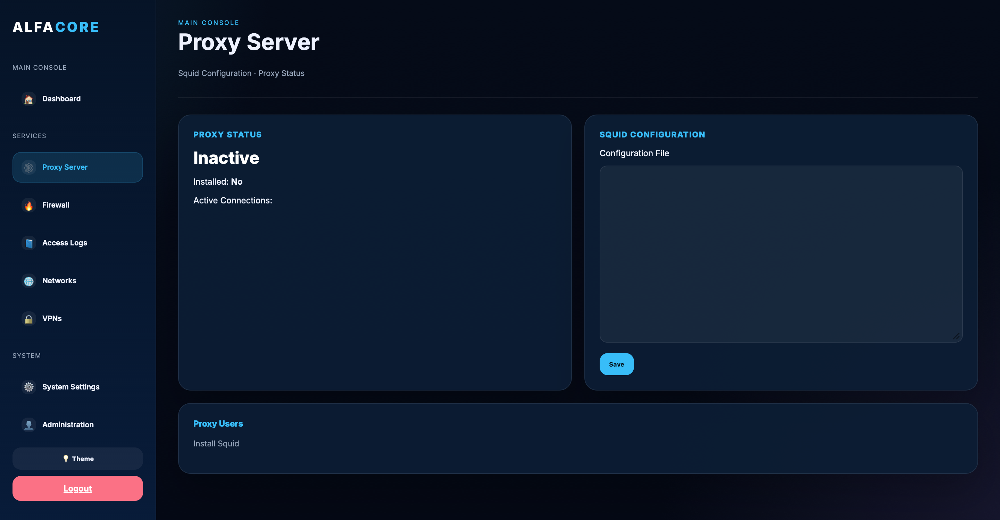
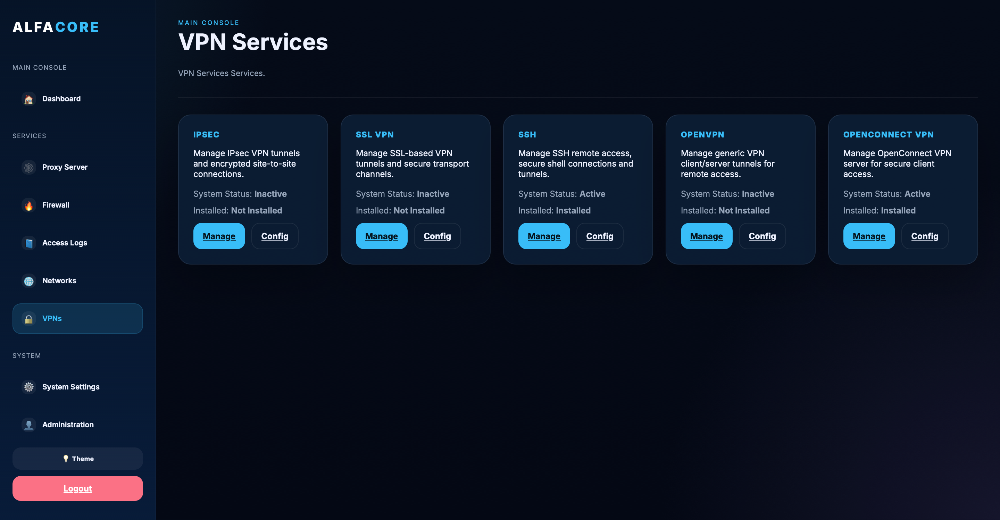

# AlfaCore - Firewall Panel Administration UI

A FastAPI-based web administration UI for managing network services on Linux, including Squid proxy, firewall rules, VPN services, network interfaces, and system settings.

## Demo



## Project Overview

This project provides a single-page admin panel for managing:

- Squid proxy configuration and proxy users
- Firewall port rules and firewalld management
- Network interface management (WAN/LAN, DHCP/static IPv4)
- NoIP.com Dynamic DNS client configuration
- VPN service tooling and service management
- System package search, updates, and backups
- Admin password and session configuration

## Example Pictures
<p>


</p>

<p>


</p>

<p>


</p>

<p>


</p>

<p>


</p>


### Core Services
- **Proxy Server** - Squid proxy configuration, user management, and traffic control
- **Firewall** - Port management and firewall rule configuration using `firewall-cmd`
- **Networks** - Ethernet and DHCP server management
- **VPNs** - Multiple VPN protocol support (OpenConnect, IPSec, SSL/TLS, SSH, OpenVPN)
- **Access Logs** - Real-time proxy access log monitoring
- **System Settings** - Package management, system updates, and package search
- **Administration** - User management, password changes, configuration backups

### Key Features
- 🔐 Secure session-based authentication with auto-logout (10 minutes)
- 🫆Network interface management using JSON storage (`/etc/squid-panel/interfaces.json`)
- 👣 NoIP.com client configuration stored in `/etc/squid-panel/noip.json`
- 👩‍🚒IPv4-only static/DHCP interface support
- 🧑🏻‍💻System command execution with shell escaping via `shlex.quote()`
- 👨🏻‍🔧Configuration backups and restore support
- 🧛‍♂️Jinja2 templates for the UI
- 📊 Real-time system status and service monitoring
- 🔧 Service installation, configuration, and lifecycle management
- 📦 DNF package management with search and install capabilities
- 💾 Automatic backup and restore of critical configurations
- 📝 Configuration file editing with live previews
- 🎨 Modern dark-themed responsive UI
- 👥 User management for OCSERV VPN and proxy services
- 🗣️ Multi languages

## New Network Features

- Add/edit/delete multiple WAN/LAN interfaces
- Apply interface changes to `/etc/sysconfig/network-scripts/ifcfg-*`
- Reload NetworkManager with `nmcli`
- Manage NoIP dynamic DNS credentials and enable/disable state

## Languages

English
Español
Français
Deutsch
Arabic
中文
 
## Project Structure

```
python_squid_admin/
├── main.py                # FastAPI application and route logic
├── README.md              # Project documentation
├── requirements-dev.txt   # Development/test dependencies
├── templates/             # Jinja2 templates for the web UI
│   ├── admin.html
│   ├── base.html
│   ├── config.html
│   ├── dashboard.html
│   ├── firewall.html
│   ├── login.html
│   ├── logs.html
│   ├── networks.html
│   ├── proxy.html
│   ├── service.html
│   ├── system.html
│   ├── vpns.html
│   └── ...
├── tests/                 # Automated project tests
│   └── test_network_interfaces.py
└── var/                   # Reserved for runtime or future use
```

## System Requirements

- OS: Linux with systemd
- Python 3.9+ (tested with Python 3.11)
- Root access for service and firewall management
- `firewalld`, `squid`, `NetworkManager` / `nmcli` if using network interfaces
- **OS**: Fedora/RHEL/CentOS with systemd
- **Python**: 3.9 or higher
- **Root Access**: Required for service and firewall management
- **System Packages**:
  - `python3` and `python3-pip`
  - `firewalld` (for firewall management)
  - `squid` (optional, can be installed via UI)
  - `ocserv` (optional, for OpenConnect VPN)
  - `openssl` (for certificate generation)

## Prerequisites Installation
python3 -m pip install -r requirements-dev.txt
Install required system packages:

```bash
sudo dnf install epel-release -y
sudo dnf install python3 python3-pip python3-devel gcc httpd-tools certbot firewalld openssl -y
sudo systemctl enable --now firewalld
```

## Installation

### 1. Create Project Directory

```bash
sudo mkdir -p /opt/squid-panel/python_squid_admin
sudo cd /opt/squid-panel/python_squid_admin
```

### 2. Set Up Python Virtual Environment

```bash
sudo python3 -m venv venv
sudo source venv/bin/activate
```

### 3. Install Python Dependencies

```bash
sudo pip install -r requirements.txt
```

## Configuration

### 1. Create Environment Configuration File

Create `/etc/squid-panel.env`:

```bash
sudo nano /etc/squid-panel.env
```

Add the following configuration:

```env
# Session and Authentication
SESSION_SECRET=ALFA_PRO_KEY_99
ADMIN_USER=admin
ADMIN_PASS=YourSecureAdminPassword

# Squid Configuration
SQUID_CONF=/etc/squid/squid.conf
SQUID_SERVICE=squid
SQUID_PORT=3128

# Backup Configuration
BACKUP_DIR=/var/backups/squid-panel
OCSERV_PASSWD_FILE=/var/lib/ocserv/ocpasswd
PASSWD_FILE=/etc/squid/passwd
```

Set proper permissions:

```bash
sudo chmod 600 /etc/squid-panel.env
```

### 2. Configure Firewall

Allow the web UI port:

```bash
sudo firewall-cmd --permanent --add-port=8444/tcp
sudo firewall-cmd --reload
```

### 3. Create Systemd Service

Create `/etc/systemd/system/squid-panel.service`:

```ini
[Unit]
Description=AlfaCore Squid Panel Administration UI
After=network.target firewalld.service
Wants=firewalld.service

[Service]
Type=simple
WorkingDirectory=/opt/squid-panel/python_squid_admin
EnvironmentFile=/etc/squid-panel.env
ExecStart=/opt/squid-panel/python_squid_admin/venv/bin/uvicorn main:app \
    --host 0.0.0.0 \
    --port 8444 \
    --reload
Restart=on-failure
RestartSec=10
User=root
StandardOutput=journal
StandardError=journal
SyslogIdentifier=squid-panel

[Install]
WantedBy=multi-user.target
```

For production with SSL, replace `ExecStart` with:

```bash
ExecStart=/opt/squid-panel/python_squid_admin/venv/bin/uvicorn main:app \
    --host 0.0.0.0 \
    --port 8444 \
    --ssl-certfile /etc/letsencrypt/live/YOUR-DOMAIN.COM/fullchain.pem \
    --ssl-keyfile /etc/letsencrypt/live/YOUR-DOMAIN.COM/privkey.pem
```

### 4. Enable and Start the Service

```bash
sudo systemctl daemon-reload
sudo systemctl enable squid-panel
sudo systemctl start squid-panel
```

Check status:

```bash
sudo systemctl status squid-panel
```

View logs:

```bash
sudo journalctl -u squid-panel -f
```

## Running Locally

For development and testing:

```bash
cd /opt/squid-panel/python_squid_admin
source venv/bin/activate
uvicorn main:app --reload --host 0.0.0.0 --port 8444
```

Then access the application at: `http://localhost:8444/login`

## Default Credentials

- **Username**: `admin` (or configured `ADMIN_USER`)
- **Password**: `password` (or configured `ADMIN_PASS`)

⚠️ **IMPORTANT**: Change these credentials immediately in `/etc/squid-panel.env` before production deployment.

## Usage Guide

### Dashboard
View overall system status, installed services, and quick access to management pages.

### Proxy Server
- View active connections
- Manage proxy users (add/remove)
- Edit Squid configuration
- Start/stop/restart Squid service

### Firewall
- View open ports
- Add/remove firewall rules
- Enable/disable firewall service
- Persist rules permanently

### Networks
- Configure Ethernet interfaces
- Manage DHCP server
- View and edit network configurations

### VPNs
Manage multiple VPN technologies:
- **OpenConnect Server (OCSERV)** - User and connection management
- **IPSec (strongSwan)** - Site-to-site VPN configuration
- **SSL/TLS Tunnels (stunnel)** - Encrypted tunnels
- **SSH** - Secure shell access
- **OpenVPN** - Generic VPN server/client

For each VPN service, you can:
- View installation steps and example configurations
- Install/uninstall services
- Start/stop services
- Edit configuration files
- Manage users (where applicable)

### System Settings
- Check available system updates
- Search and install packages
- Remove installed packages
- View installed package count
- Monitor system resources

### Administration
- Change admin password
- Create system configuration backups
- Download backups for offline storage
- Delete old backups
- View backup history

## Security Considerations

### Authentication & Sessions
- ✓ Session-based authentication with 10-minute auto-logout
- ✓ Credentials stored in environment variables
- ⚠️ Change default admin credentials before production use
- ⚠️ Use strong, unique SESSION_SECRET in production

### System Access
- ⚠️ Application runs as root (required for system management)
- ⚠️ Web UI executes system commands - only expose on trusted networks
- ✓ All shell arguments are properly escaped using `shlex.quote()`
- ✓ Configuration file paths validated against BACKUP_DIR

### Best Practices
1. Run behind a reverse proxy with HTTPS/TLS
2. Use Let's Encrypt certificates (included in prerequisites)
3. Restrict firewall access to administrative networks
4. Regularly backup configurations using the admin panel
5. Monitor system logs: `sudo journalctl -u squid-panel -f`
6. Keep Python packages updated: `pip install --upgrade -r requirements.txt`

## Troubleshooting

### Service Won't Start
```bash
sudo systemctl status squid-panel
sudo journalctl -u squid-panel -n 50
```

### Port Already in Use
Change port in systemd service or check what's using 8444:
```bash
sudo netstat -tlnp | grep 8444
```

### Permission Denied
Ensure the application runs as root (User=root in systemd service) or with proper capabilities for system commands.

### Package Search Not Working
Verify `dnf` is installed and accessible:
```bash
sudo dnf search vim
```

### Backup Issues
Check backup directory permissions:
```bash
sudo ls -la /var/backups/squid-panel
```

## Logs and Monitoring

View real-time application logs:
```bash
sudo journalctl -u squid-panel -f
```

View Squid access logs:
```bash
sudo tail -f /var/log/squid/access.log
```

View firewall logs:
```bash
sudo journalctl -u firewalld -f
```

## API Endpoints

All endpoints require authentication via session login.

### Authentication
- `GET /login` - Login page
- `POST /login` - Process login
- `GET /logout` - Logout

### Dashboard & Main Pages
- `GET /` - Dashboard
- `GET /proxy` - Proxy management
- `GET /firewall` - Firewall management
- `GET /logs` - Access logs
- `GET /networks` - Network configuration
- `GET /vpns` - VPN services
- `GET /system` - System settings
- `GET /admin` - Administration panel

### Service Management
- `GET /service/{service_key}` - Service details
- `POST /service/{service_key}/manage` - Service actions (install/start/stop/etc)
- `GET /service/{service_key}/config` - Service configuration editor
- `POST /service/{service_key}/config` - Save service configuration

### User Management
- `POST /proxy-user` - Manage Squid users
- `POST /ocserv-user` - Manage OCSERV VPN users

### System Management
- `POST /system/search-packages` - Search for packages
- `POST /system/install-updates` - Install system updates
- `POST /system/install-package` - Install a package
- `POST /system/remove-package` - Remove a package

### Administration
- `POST /admin/change-password` - Change admin password
- `POST /admin/create-backup` - Create configuration backup
- `GET /admin/download-backup/{backup_name}` - Download backup
- `POST /admin/delete-backup` - Delete backup

## Dependencies

See `requirements.txt` for detailed versions. Main dependencies:

- **FastAPI** - Web framework
- **Uvicorn** - ASGI server
- **Jinja2** - Template engine
- **Starlette** - ASGI toolkit (for session middleware)
- **python-multipart** - Form data handling
- **itsdangerous** - Session security

## Usage Summary

- `/login` — login page
- `/` — dashboard
- `/proxy` — Squid proxy management
- `/firewall` — firewall management
- `/networks` — network interfaces and NoIP configuration
- `/logs` — access log viewing
- `/admin` — administration and backups

## Notes

- This panel is designed for Linux systems with root-level access.
- The network feature is IPv4-only and stores interface settings in JSON.
- NoIP credentials are saved in plain JSON; secure the host and config directory.


## Author

**Rizwan Saleem**

## License

This project is provided as-is for system administration purposes.

## Support & Contribution

For issues, feature requests, or contributions, please contact the development team.

---

**Last Updated**: May 2026
**Version**: 2.0 (AlfaCore)
